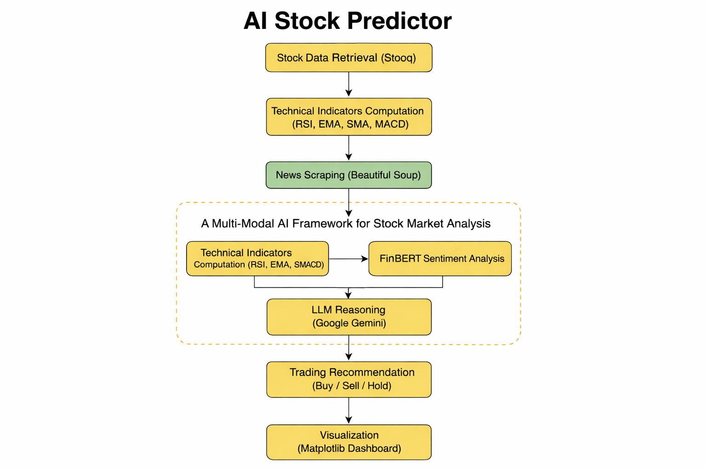
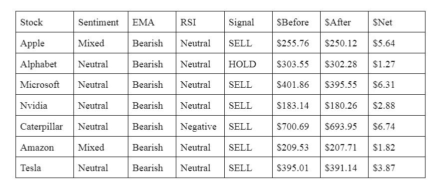
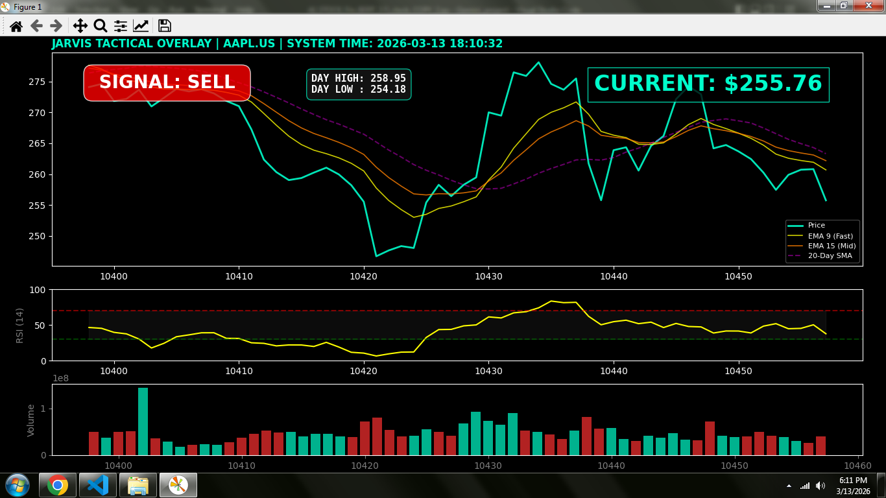
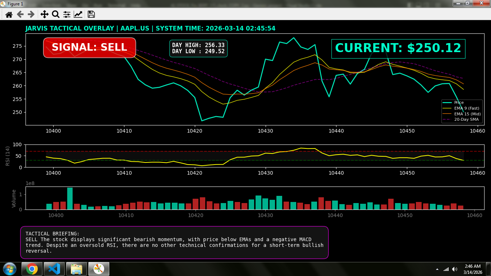
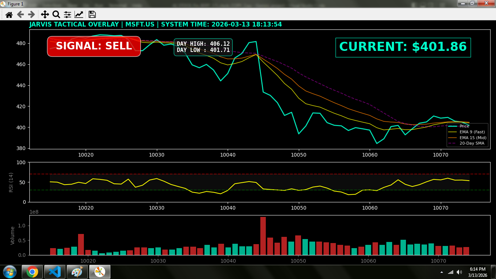
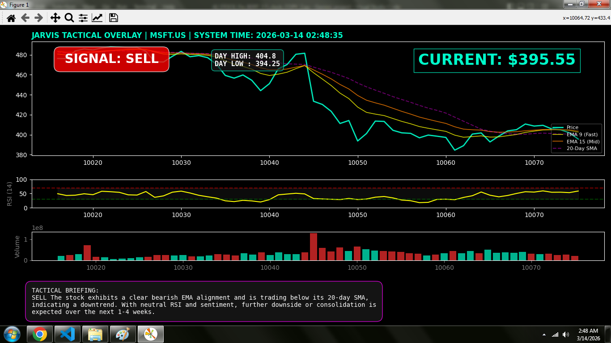
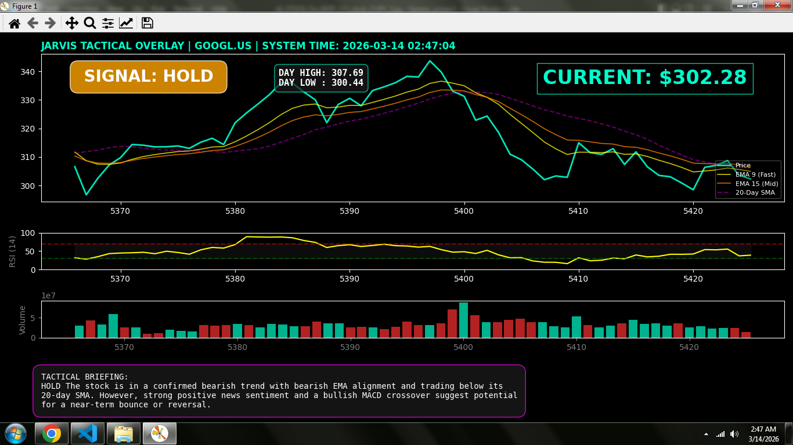

# AI_Stock_predictor
A Multi-Modal AI Framework for Stock Market Analysis Using Technical Indicators, FinBERT Sentiment Analysis, and LLM-Based Reasoning

This project explores how modern AI tools can assist in interpreting market signals by integrating **data analysis, NLP sentiment models, and generative AI explanations**.

⚠️ **This project is for educational and research purposes only. It is not intended for real trading or financial advice.**

---

# Project Overview

Financial markets are highly volatile and influenced by both **technical trends and external news sentiment**.
This project attempts to combine multiple information sources into a single analytical pipeline.

The system performs the following steps:

1. Fetch historical stock data
2. Compute technical indicators
3. Scrape latest financial news
4. Run sentiment analysis using FinBERT
5. Generate reasoning using an LLM
6. Display a visual technical dashboard

The final output is a **BUY / SELL / HOLD prediction with reasoning**.

---

# System Architecture
## System Architecture

The system follows a multi-stage pipeline where technical indicators,
news sentiment, and AI reasoning combine to produce trading signals.



The analysis pipeline consists of three major components:

### 1. Technical Analysis Engine

Calculates multiple indicators including:

* RSI (Relative Strength Index)
* EMA 9 and EMA 15
* 20-Day SMA
* MACD
* Volume analysis
* Trend detection

These indicators provide signals about:

* momentum
* trend direction
* overbought / oversold conditions

---

### 2. News Sentiment Analysis

Latest financial headlines are scraped from Google Finance and processed using the FinBERT financial sentiment model.

The system:

* extracts news headlines
* runs each headline through FinBERT
* averages the sentiment scores

Sentiment categories:

* Bullish
* Bearish
* Neutral

---

## Backtesting Output

The system can simulate trading decisions based on the generated signals.
Table Screenshot


---

### 3. AI Reasoning Layer

A generative AI model analyzes the combined data.

Inputs provided to the model:

* technical indicators
* market trend
* volume conditions
* sentiment results

The AI then produces:

BUY
SELL
HOLD

Along with a short explanation.

---

# Visualization Dashboard

The system generates a **technical analysis dashboard** that includes:

* Price chart
* EMA overlays
* 20-day SMA trend
* RSI momentum panel
* Volume activity
* AI tactical briefing

Sample visualization:
### MSFT Example


    
---

# Example Output

Below are examples of the visualization dashboard generated
by the system during stock analysis.

### Apple (AAPL)




Based on the computed indicators and sentiment analysis, the model predicted a
short-term downward movement
After market opening, the stock price declined from $255.76 to $250.93, confirming the
predicted bearish direction





The updated system interface, shown in Figure, provides the final AI reasoning summary
through the tactical briefing window


### Microsoft (MSFT)




Based on the technical indicators and FinBERT sentiment analysis, the model predicted a dodwnard movement
After market opening, the stock price declined from $401.86 to $395.55, confirming the
predicted bearish direction





The updated system interface, shown in Figure, provides the final AI reasoning summary
through the tactical briefing window

---

### Alphabet Inc Class C (Google) (GOOGL)

During the Analysis, the technical indicators
continued to indicate a bearish trend. However, the sentiment analysis module detected positive
news signals associated with Alphabet.
As a result, the final recommendation shifted from SELL to HOLD, illustrating the importance
of incorporating sentiment signals alongside traditional technical indicators. This example
demonstrates how the multi-modal framework allows the system to balance quantitative market
signals with qualitative information derived from financial news



# Technologies Used

* Python
* Pandas
* Matplotlib
* BeautifulSoup
* Financial NLP models
* Large Language Models
* REST APIs

External services used:

* FinBERT sentiment model
* Generative AI reasoning model
* Financial market data APIs

---

# Installation

Clone the repository:

```
git clone https://github.com/YOUR_USERNAME/AI_Stock_Predictor.git
cd AI_Stock_Predictor
```

Install dependencies:

```
pip install -r requirements.txt
```

---

# API Setup
Write your own api key at API_KEY (Google Gemini)
Required APIs:

```
API_KEY = your_api_key
HF_API_KEY = your_huggingface_key
```

---

# Running the Program

Run the script:

```
python stock_predictor_ai.py
```

Enter the ticker symbols when prompted.

Example:

```
Enter list of tickers: AAPL MSFT NVDA
```

The system will then:

* fetch market data
* analyze news sentiment
* generate AI predictions
* display the technical dashboard

---

# Project Future improvements

This project is an experimental prototype.

Future improvements may include:

* LSTM / deep learning forecasting
* reinforcement learning trading agents
* portfolio risk management
* automated backtesting engine
* Implement automated trade execution with dynamic target price and stop-loss mechanisms to enable systematic buy and sell operations
---

# Disclaimer

This project is strictly for **educational and research purposes**.

It does **not provide financial advice**.

Trading stocks involves risk and the creator assumes **no liability for financial losses**.

Always consult a qualified financial advisor before making investment decisions.

---

# Author

Developed as an experimental AI research project exploring **AI-assisted financial analysis**.
